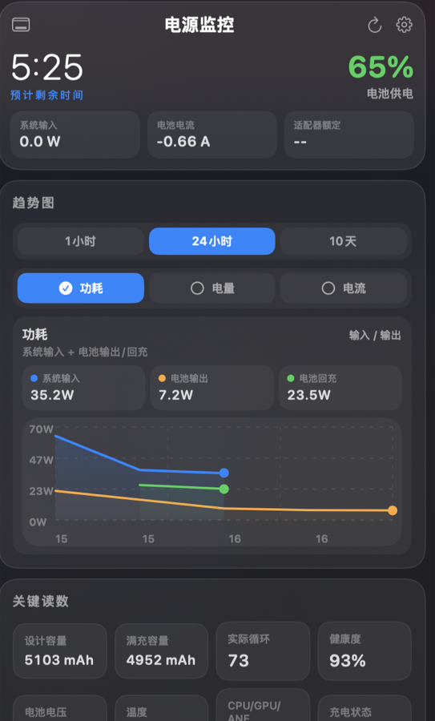
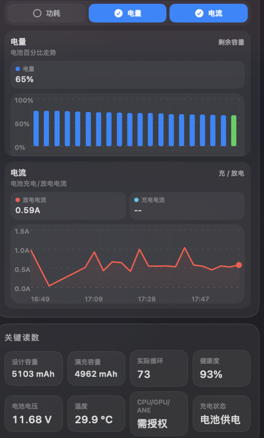

<div align="center">

# Maco Power Monitor

Native macOS menu bar power monitor for Apple Silicon.

Real battery, adapter and power telemetry.
Compact glass panel.
No fake data.

[](https://github.com/LCYLYM/MacoPowerMonitor/releases/latest)
[](https://github.com/LCYLYM/MacoPowerMonitor/releases/latest)
[](https://github.com/LCYLYM/MacoPowerMonitor/releases/latest)
[](https://www.swift.org/)
[](LICENSE)

[Download Latest Release](https://github.com/LCYLYM/MacoPowerMonitor/releases/latest) • [Report Bug](https://github.com/LCYLYM/MacoPowerMonitor/issues/new?template=bug_report.md) • [Request Feature](https://github.com/LCYLYM/MacoPowerMonitor/issues/new?template=feature_request.md)

[Direct ZIP Download](https://github.com/LCYLYM/MacoPowerMonitor/releases/latest/download/MacoPowerMonitor-v0.1.0-macos.zip)

</div>

---

Maco Power Monitor is a lightweight macOS status bar utility that helps you understand where your battery and power budget are going in real time.

It focuses on three things:

- Real system data only
- Low overhead native menu bar UX
- Dense, readable power insights without fake precision

## Preview

<p align="center">
  
  
</p>

## Why It Feels Different

- Native all the way: built with `SwiftUI + AppKit + IOKit`, no Electron, no embedded browser runtime
- Real metrics only: battery, adapter and process-energy data come from macOS system interfaces and commands
- Compact by design: click the menu bar icon, inspect what matters, dismiss and move on
- High signal UI: system input, battery output, recharge flow, current, battery health and top energy users in one place
- Honest constraints: when a metric needs admin permission or cannot be read reliably, the app says so instead of inventing numbers

## Highlights

| What you get | Why it matters |
| --- | --- |
| Menu bar status icon | See battery state instantly and open the panel with one click |
| Glass-style compact panel | macOS-native visual feel with dense information layout |
| Multi-select chart toggles | Show `Power`, `Battery`, and `Current` together instead of constant chart switching |
| Bidirectional power view | Distinguish `System Input`, `Battery Output`, and `Battery Recharge` clearly |
| Charge and discharge current | Understand battery flow direction without ambiguous mixed lines |
| Real battery health metrics | Design capacity, full charge capacity, cycle count, health percentage, voltage, temperature |
| Top energy processes | Quickly spot which apps are draining power right now |
| On-demand SoC sampling | CPU / GPU / ANE breakdown via privileged sampling when you explicitly allow it |

## Install

### Option 1: Download the app

1. Open [Latest Release](https://github.com/LCYLYM/MacoPowerMonitor/releases/latest)
2. Download `MacoPowerMonitor-v0.1.0-macos.zip`
3. Unzip it
4. Move `MacoPowerMonitor.app` into `Applications`
5. Launch the app and click the menu bar icon

### Option 2: Build from source

Requirements:

- macOS 13 or newer
- Xcode Command Line Tools or full Xcode

```bash
swift build
swift run
```

### Option 3: Package locally

```bash
./scripts/package_app.sh
open dist/MacoPowerMonitor.app
```

To create the same release-style zip and checksum used for GitHub Releases:

```bash
./scripts/build_release_assets.sh
```

## Data Sources

All on-screen readings are backed by real macOS data sources.

- `IOPowerSources` / `IOPSGetPowerSourceDescription`
- `IOPSCopyExternalPowerAdapterDetails`
- `ioreg -r -c AppleSmartBattery -a`
- `system_profiler SPPowerDataType -json`
- `top -l 1 -stats pid,command,cpu,mem,power`
- `powermetrics`

Notes:

- `powermetrics` is only used for detailed CPU / GPU / ANE power when you explicitly trigger privileged sampling
- the app does not fill missing fields with fabricated estimates

## What The Charts Mean

- `Power`: shows system input, battery output, and battery recharge as separate flows
- `Battery`: shows battery percentage history
- `Current`: separates discharge current and charge current instead of mixing directions together

This is intentional.
Adapter rated wattage, actual system input and battery-side flow are not the same thing, so the app keeps them distinct.

## Privacy and Security

- no telemetry upload
- no third-party analytics SDK
- no cloud account requirement
- no hidden background elevation loop
- local history stays on your Mac at `~/Library/Application Support/MacoPowerMonitor/power-history.json`

## Project Structure

```text
Sources/MacoPowerMonitor/App
Sources/MacoPowerMonitor/Core
Sources/MacoPowerMonitor/Services
Sources/MacoPowerMonitor/Support
Sources/MacoPowerMonitor/UI
scripts
docs/images
```

- `App`: menu bar lifecycle, floating panel, app startup behavior
- `Core`: core models and chart series definitions
- `Services`: system collectors, persistence, scheduling, privileged power sampling
- `Support`: constants, formatting, paths, helpers
- `UI`: dense dashboard layout, glass styling, charts, settings and reusable components

## Development Principles

- no mocked battery or power data
- public or system-backed data sources first
- low wake-up cost and lightweight background behavior
- explicit distinction between rated power, current input and battery flow
- modular architecture for future expansion

## Roadmap

- launch at login
- battery event timeline
- historical export
- adapter mismatch and thermal alerts
- broader Apple Silicon validation

## Contributing

- contribution guide: [CONTRIBUTING.md](CONTRIBUTING.md)
- security policy: [SECURITY.md](SECURITY.md)

## License

Released under the [MIT License](LICENSE).
